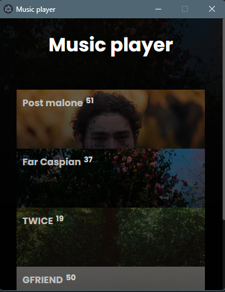
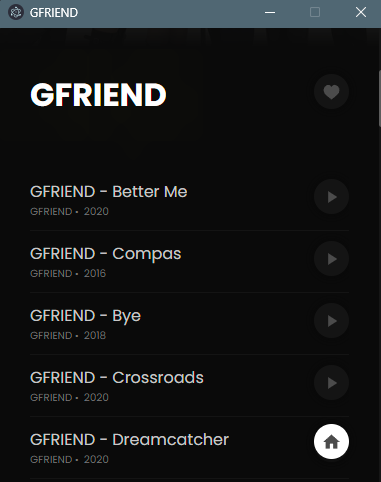

# Music player 🍃

A local music player using [Electron](https://www.electronjs.org/).

## Features 🍜

1. Automatic search in an assigned directory.
2. Option to set the image of an album, simply by adding an image in the song album.
3. Like the albums you like the most (Coming soon).
4. Easy, intuitive and user-friendly design.
5. Configurable using a yml.file.
6. Sequential playback (Shuffle playback coming soon).
7.

## Configuration

Configure your application as you wish. An .yml file is easy to configure and is the point to apply your settings.

```yml
path:
  music_directory: 'your-best-songs-path'
```

## Preview 🍱

A preview of the player and its features

### Main page ✨




### Song page 🧃



