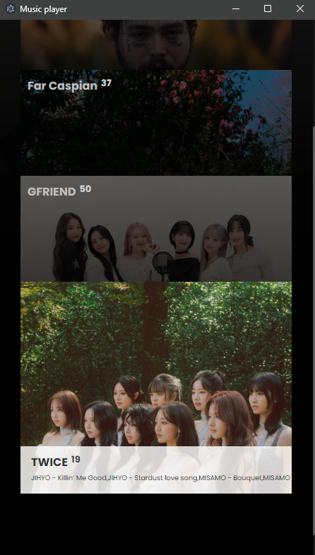
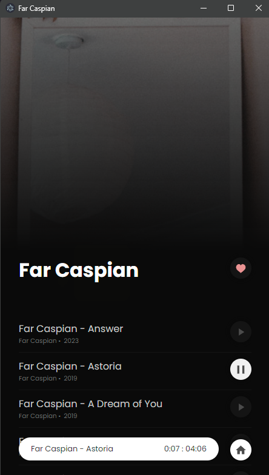

# Music player 🍃

A local music player using [Electron](https://www.electronjs.org/).

## Features 🍜

1. Automatic search in an assigned directory.
2. Option to set the image of an album, simply by adding an image in the song album.
3. Like the albums you like the most (Coming soon).
4. Easy, intuitive and user-friendly design.

## Preview 🍱

### Main page ✨

### Song page 🧃

